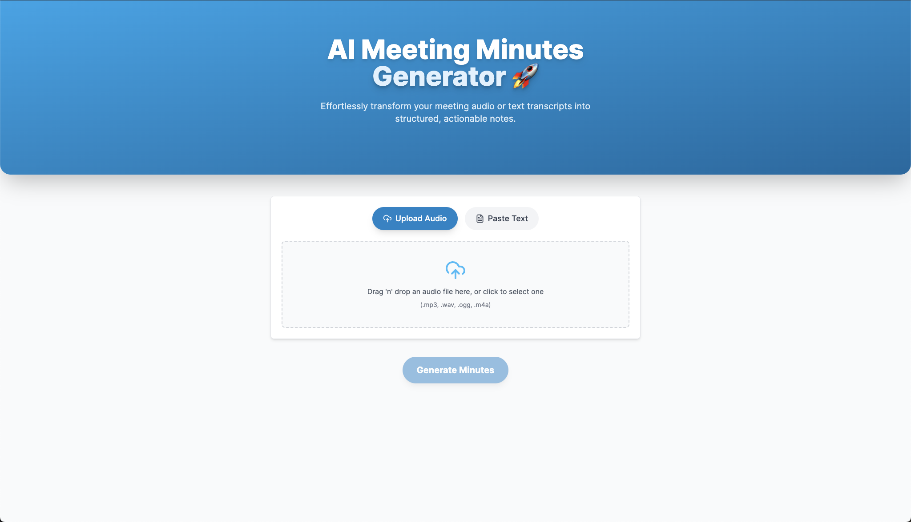
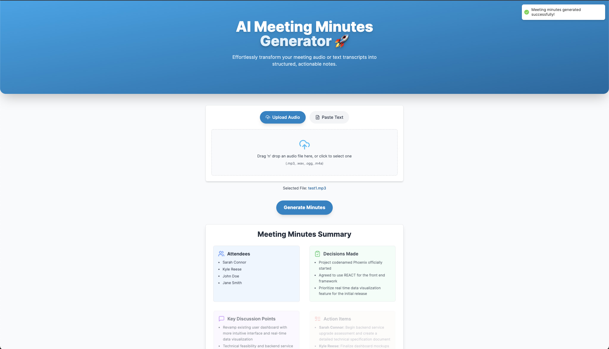
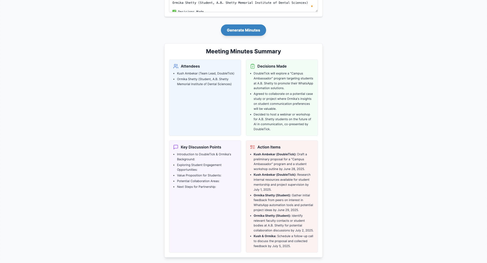

# 📋 AI Meeting Minutes Generator 🚀

Effortlessly transform meeting audio or transcripts into structured, actionable meeting notes using the power of **AI**.

---

## ✅ Tech Stack

- **Frontend:** Next.js + Tailwind CSS + Framer Motion  
- **Backend:** Node.js + Express  
- **Transcription:** [AssemblyAI](https://www.assemblyai.com/)  
- **Summarization:** [Google Gemini](https://deepmind.google)

---

## ✨ Features

- 🎙️ **Flexible Input:** Upload audio (`.mp3`, `.wav`, `.m4a`, `.ogg`) or paste a transcript.
- 📝 **Accurate Transcription:** High-quality speech-to-text via AssemblyAI.
- 🧠 **Smart Summarization:** Gemini organizes notes into:
  - Attendees  
  - Decisions Made  
  - Key Discussion Points  
  - Action Items  
- 📧 **One-Click Email:** Simulated email sending (extendable to production).
- 🎨 **Smooth UX:** Clean, responsive UI with subtle animations.
- 🗂️ **Robust:** Handles large audio files with clear user feedback.

---

## 🗂️ Project Structure

## 🗂️ Project Structure

```plaintext
ai-meeting-minutes-generator/
├── frontend/          # Next.js frontend
│   ├── pages/
│   ├── components/
│   ├── public/
│   ├── styles/
│   ├── .env.local     # Frontend env vars
│   ├── package.json
│   ├── next.config.js
│   └── tailwind.config.js
└── backend/           # Express backend
    ├── server.js      # Main server
    ├── .env           # Backend env vars
    ├── package.json
    └── uploads/       # Temp audio files (auto-cleaned)
```

---

## ⚙️ Local Setup
# ✅ Prerequisites

- **Node.js (v18+ recommended)**
- **npm or yarn**
- **Google Gemini API key**
- **AssemblyAI API key (free tier available)**

---

## 1️⃣ Clone the Repository

- git clone https://github.com/your-username/ai-meeting-minutes-generator.git
- cd ai-meeting-minutes-generator

## 2️⃣ Backend Setup

- cd backend
- npm install

---

Create a .env file in /backend with the following:

- PORT=5001
- GEMINI_API_KEY=YOUR_GOOGLE_GEMINI_API_KEY
- ASSEMBLYAI_API_KEY=YOUR_ASSEMBLYAI_API_KEY
- FRONTEND_URL=http://localhost:3000

---

Start the backend server:

npm run dev

✅ Backend running at: http://localhost:5001

---

## 3️⃣ Frontend Setup
Open a new terminal tab:

- cd frontend
- npm install

---

Create a .env.local in /frontend:

NEXT_PUBLIC_BACKEND_URL=http://localhost:5001

---

Start the frontend:

npm run dev

✅ Frontend running at: http://localhost:3000

---

## 🚀 Deployment

✅ Deploy Frontend (Vercel)

- Push your repo to GitHub.
- Sign in to Vercel and import the repo.
- Set Root Directory to /frontend.
- Add an environment variable: NEXT_PUBLIC_BACKEND_URL=[Your backend production URL]
- Click Deploy!


✅ Deploy Backend (Railway or Render)

- Sign in to Railway or Render.
- Link your GitHub repo.
- Set the backend folder (/backend) as the service root.
- Add environment variables:
  - PORT (set to 5001 or let the platform auto-assign)
  - GEMINI_API_KEY
  - ASSEMBLYAI_API_KEY
  - FRONTEND_URL → your live frontend URL (from Vercel)
- Click Deploy!

👉 Update your Vercel NEXT_PUBLIC_BACKEND_URL to the live backend URL after deployment.


---

## ✅ How it Works

- Upload Audio → AssemblyAI transcribes the file.
- Gemini processes the transcript and generates a structured JSON.
- Frontend displays the minutes in a beautiful grid layout.
- Send Email → Simulated for now (plug in SendGrid/Nodemailer for production).

---

## 🙌 Credits

- 🎙️ AssemblyAI — Speech-to-text API
- 🤖 Google Gemini — Generative summarization
- ⚛️ Next.js — React framework
- 🎨 Tailwind CSS — Modern styling
- 🎞️ Framer Motion — Smooth animations

---

## 📄 License

- MIT — free to use & modify.
- ⭐️ Star this repo if you find it helpful!

## 📸 Demo Screenshots


### 🎉 Home Page


### 🔼 Upload Audio


### 📄 Generated Minutes


### 📄 Generated Results


